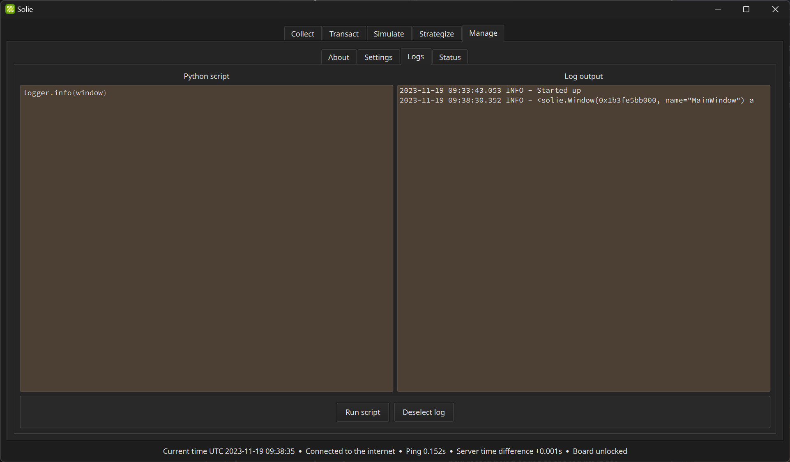
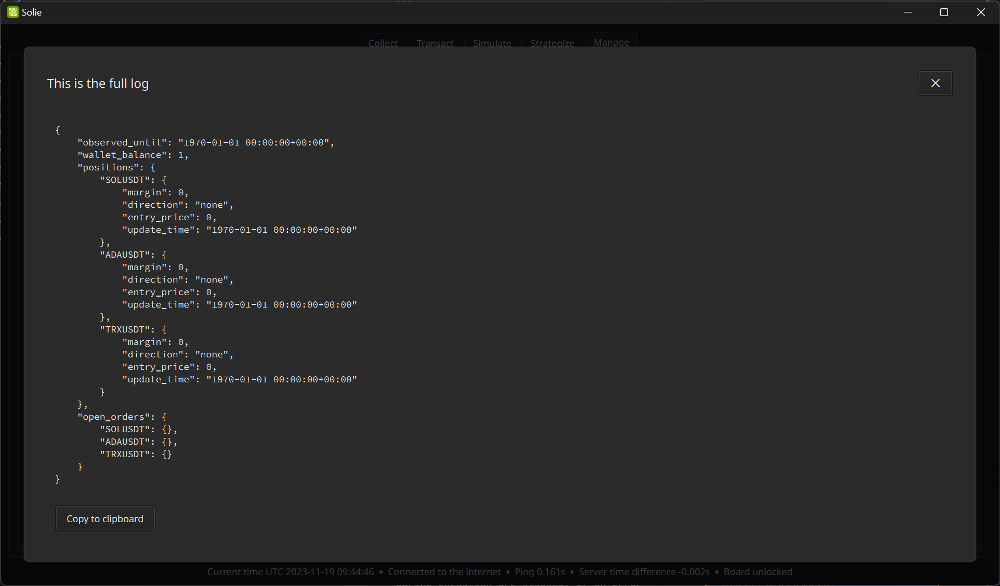

# Developing Solie

There are things that must be known in the process of making Solie.

## Procedure

1. Install Poetry[🔗](https://python-poetry.org/).

   ```bash
   pip install pipx
   python -m pipx ensurepath
   # You might need to restart the terminal here
   pipx install poetry
   ```

2. Prepare the virtual environment with the command below.

   ```bash
   poetry install
   ```

3. The user interface can be changed by editing the `./craft/user_interface.ui` file with the `Qt Designer`. Open it with below terminal command.

   ```bash
   pyside6-designer
   ```

4. After editing the UI file, you have to compile it as a Python module.

   ```bash
   pyside6-uic craft/user_interface.ui -o module/user_interface.py
   ```

5. Make a commit in a branch other than `main` and create a pull request.

## Rules

- Solie is made purely in Python and uses Poetry as the default package management tool.
- Use Ruff formatter for formatting and linting.
- Use Pyright's basic type checking. If you're using Visual Studio Code, Pylance will provide a superset of Pyright’s functionality.
- It should be easy for general users to use with just a few clicks.
- It should be developed with the goal of working on both `Windows`, `Linux`, and `macOS`. Do not use platform-dependent packages such as `win32api`.
- The `print` command is only for development purposes only and should not be included in the final code. If there is information to be shown, it must be displayed in the user interface.
- When a value is added to data that has a table form, it should be occupied by `datalocks` and then written at once so that one row can always be assumed to be completely intact. Be careful that there is no instantaneous blank space after a new row is added.
- Time zone information must be included in UTC in `datetime.datetime` object. In addition to this, please include UTC time zone information wherever possible, such as `pandas.DatetimeIndex`.

  ```python
  from datetime import datetime, timezone
  my_datetime = datetime.now(timezone.utc)
  ```

## Debugging

- All scripts used in Solie are pure Python.

- If there is Python code that you want to run, you can run it in the `Debugger` of the `Manage` tab. After writing the code in the `Python Script` input device, the code is executed when the `Run Code` button is pressed.
  

  > The `print` function prints to an invisible terminal rather than a log.

- To output as a log, you can use the default `logger`. When you run this code, you will see a new record being added to the log list in the `debugger`.

  > Internally, `logger` is the object returned by `logging.getLogger("solie")`.

  ```python
  logger.debug("What you want to know about")
  ```

  

- `logger` can print anything that is not in `str` format. You can also select importance.

  > In order of importance, there are 5 types: `DEBUG`, `INFO`, `WARNING`, `ERROR`, and `CRITICAL`. `logging` by default only outputs logs with a criticality of `WARNING` or higher, but the `logger` provided here will output logs of all criticalities as an exception.

  ```python
  my_dictionary = {"a": "yahoo", "b": "hi"}
  logger.info(my_dictionary)
  ```

  

- You can also access the window with the `window` variable. Although not recommended, it also allows direct modification of internal data.

  ```python
  logger.debug(window.transactor.account_state)
  ```

  

- If the format of the variable you want to output is `list` or `dict`, you can also output it much better with the help of the `json` standard library.

  ```python
  import json
  log_data = json.dumps(window.transactor.account_state, indent=4, default=str)
  logger.debug(log_data)
  ```

  

- In `log output`, all logs that occur during execution are stacked. If an error occurs, it is also logged. If you're writing a strategy script and something doesn't work, you can come here to figure out the cause.
  

## Variable Terminology

- `amount` has a negative value for a short position and a positive value for a long position. It is expressed in units of each coin, not dollars.
- `role` has only one of two values, `maker` or `taker`, depending on whether liquidity was supplied at the time of trading.
- `moment` refers to the reference time used for data recording. Structurally, it points to a row in a series or dataframe.
- `undertake` executes the function attached as an argument in the main thread. This method is necessary because of the nature of the `PyQt` package, which is not multithread safe. If you try to read or modify the user interface in another thread, you may experience catastrophic problems or force termination. Enter the function to be executed as the first argument and whether to wait for the return value as the second argument.

  > The main thread is occupied by an infinite event loop in the `PyQt` package. `undertake` is what tells this event loop to execute the function.

- `datalocks` is required due to the nature of some packages not being multithread stable. Objects created with this package should never be read or modified concurrently by multiple threads.
  - `pandas`
  - `numpy`
